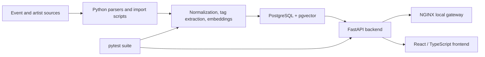

# Berlin Scene Graph

A backend and data-workflow prototype for exploring relationships between artists, events, promoters, venues, and genres, then using those relationships to produce explainable recommendations.

The repository is a work in progress. Its strongest current area is the backend foundation: FastAPI endpoints, PostgreSQL data modeling, import and enrichment scripts, graph and semantic scoring, Docker Compose, and pytest coverage.

## Problem

Music-scene data is spread across event listings, lineups, biographies, venues, and promoter histories. Berlin Scene Graph brings those sources into a normalized relational model so the backend can answer questions such as:

- Which artists are semantically or stylistically related?
- Which promoters are relevant to an artist?
- Which events share artists, promoters, venues, genres, or extracted tags?
- What evidence contributed to a recommendation?

## Current capabilities

- FastAPI REST API with generated OpenAPI documentation
- PostgreSQL and pgvector-backed data model
- Prisma schema and migrations
- Event and artist import workflows
- Text normalization and entity-tag extraction
- Embedding generation and semantic similarity
- Graph-aware artist, event, and promoter recommendations
- Recommendation feedback storage
- Docker Compose local development stack
- pytest coverage for API behavior, extraction, normalization, embeddings, graph logic, and recommendation scoring

## Architecture



See [docs/architecture.md](docs/architecture.md) for the component and data-flow details.

## Tech stack

**Backend and data:** Python, FastAPI, psycopg, PostgreSQL, pgvector, Prisma migrations, pytest

**Local infrastructure:** Docker, Docker Compose, NGINX

**Frontend:** React, TypeScript, Vite

**Optional enrichment providers:** OpenAI or Azure OpenAI, configured through environment variables

## Repository structure

```text
backend/app/        FastAPI application and recommendation logic
backend/app/routers/ REST endpoint modules
backend/scripts/    import, validation, normalization, and enrichment scripts
backend/tests/      pytest suite
backend/prisma/     schema and migrations
parsers/            event and artist data collection workflows
frontend/           React / TypeScript client
docs/               current API and architecture documentation
docker-compose.yml  local development stack
Makefile            common development commands
```

## Local setup

Requirements:

- Docker with Docker Compose v2
- GNU Make
- Optional provider API key for extraction or embedding workflows

Create a local environment file:

```bash
make env
```

Use local placeholder values and do not commit `.env`:

```env
POSTGRES_DB=scenegraph
POSTGRES_USER=scenegraph
POSTGRES_PASSWORD=replace-with-a-local-password
POSTGRES_PORT=5432
DATABASE_URL=postgresql://scenegraph:replace-with-a-local-password@db:5432/scenegraph

EMBEDDING_PROVIDER=openai
OPENAI_API_KEY=replace-only-if-using-openai
EXTRACTION_PROVIDER=openai
VITE_API_URL=http://localhost:8080/api
```

The backend can also use an externally managed PostgreSQL database through `DATABASE_URL`, but the documented default is the local Docker Compose database.

Build and start the local stack:

```bash
make upd
```

This applies Prisma migrations and starts PostgreSQL, the FastAPI backend, frontend, and NGINX gateway.

Useful commands:

```bash
make ps
make logs
make db-shell
make prisma-migrate
make down
```

Local entry points:

- Gateway: `http://localhost:8080`
- OpenAPI UI: `http://localhost:8080/docs`
- Health check: `http://localhost:8080/health`

## Data workflow

Use the full local ingestion pipeline:

```bash
make full-pipeline
```

This runs the end-to-end import/enrichment flow in Docker. Optional extraction and embedding stages still require the corresponding provider configuration.

## API examples

```bash
curl -s http://localhost:8080/health
curl -s "http://localhost:8080/api/search?q=artist"
curl -s "http://localhost:8080/api/recommendations/artists/2178?limit=5"
curl -s "http://localhost:8080/api/recommendations/artists/2178/promoters?limit=5"
curl -s "http://localhost:8080/api/graph/ego?type=artist&id=2178"
```

See [docs/api.md](docs/api.md) for endpoint groups, request bodies, and abbreviated response examples.

## Testing

Run the backend suite inside the development container:

```bash
docker compose exec backend pytest -q
```

Run a focused module:

```bash
docker compose exec backend pytest tests/test_recommendation_scoring.py -q
docker compose exec backend pytest tests/test_graph_api.py -q
```

The repository currently includes tests for recommendation scoring, graph responses, semantic similarity, embeddings, text profiles, tag extraction, and lineup normalization.

## Documentation

- [API guide](docs/api.md)
- [Architecture and data flow](docs/architecture.md)
- [Recommendation engine notes](docs/recommendation-engine.md)
- [Frontend recommendation contract](docs/frontend-recommendations-contract.md)

Older files under `documentation/` are planning artifacts and may not match the current implementation.

## Current status and limitations

- Prototype and backend foundation, not a production-ready service
- Recommendation quality depends on imported data coverage and enrichment quality
- Some extraction and embedding workflows depend on external providers
- Authentication is currently a placeholder and should not be treated as secure
- Public API authentication, rate limiting, monitoring, and production security hardening are not implemented
- The frontend does not yet expose every backend recommendation workflow
