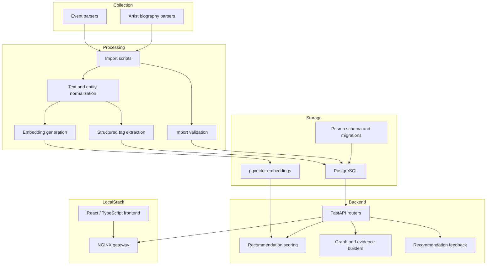

# Architecture and Data Flow

Berlin Scene Graph is currently a backend-oriented prototype. It combines collection scripts, normalization and enrichment steps, a PostgreSQL data model, recommendation logic, and a REST API.

## Component overview

## Data flow

1. Parser workflows collect event and artist source data.
2. Import scripts map source records into the PostgreSQL schema.
3. Backfill scripts normalize biographies, lineups, and text profiles.
4. Optional extraction workflows produce structured artist and event tags.
5. Optional embedding workflows store semantic vectors for similarity search.
6. Recommendation services combine semantic, style, tag, and graph signals.
7. FastAPI routers return entity, graph, recommendation, and feedback responses.
8. pytest modules validate pure scoring logic and selected database/API behavior.

## Backend boundaries

- `backend/app/routers/` defines the HTTP surface.
- `backend/app/recommendation_services.py` builds API-facing recommendation responses.
- `backend/app/recommendation_scoring.py` contains scoring helpers and configurable weights.
- `backend/app/promoter_graph.py` and related graph modules build relationship evidence.
- `backend/app/text_profiles.py` and extraction modules prepare enrichment inputs.
- `backend/app/db.py` manages psycopg database access.
- `backend/prisma/` defines the schema and migrations.

## Local development stack

Docker Compose starts:

- PostgreSQL with pgvector
- FastAPI backend with source mounts for development
- React / TypeScript frontend
- NGINX gateway on port `8080`
- Optional Prisma tools profile

The local stack is intended for development and evaluation. Production concerns such as secure authentication, rate limiting, monitoring, backups, and hardened network policy are outside the current implementation.
