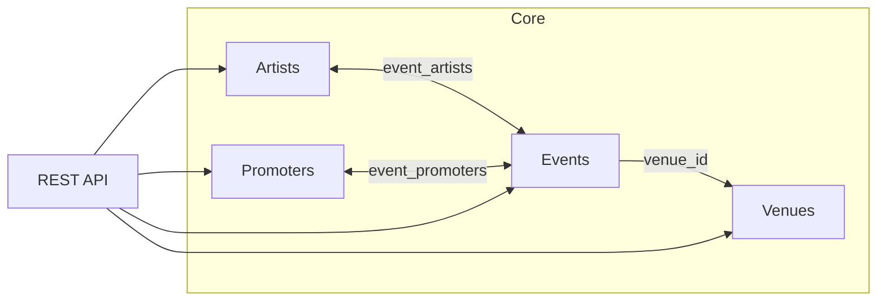

# Berlin Scene Graph API Reference

This document describes the REST API exposed by the Berlin Scene Graph backend.

It provides advanced full-text search capabilities, ego-graph generation for network visualization, and built-in administrative metrics to monitor database integrity and data composition.

All endpoints are available through the NGINX gateway under the `/api` prefix.

## Authentication

The Berlin Scene Graph API provides two levels of access:

| Access Level      | Endpoints                                                               |
| ----------------- | ----------------------------------------------------------------------- |
| **Public**        | Search, Artists, Events, Venues, Promoters, Genres, and Graph endpoints |
| **Authenticated** | Admin endpoints (`/api/admin/*`)                                        |

Public endpoints provide read-only access and do not require authentication.

Administrative endpoints expose internal dataset metrics and analytics and therefore require authentication.


## Technical Stack
* **Framework:** FastAPI (Python)
* **Database:** PostgreSQL (accessed via `psycopg` for raw, optimized SQL queries)
* **Validation:** Pydantic models
* **Key Features:** Full-Text Search (`tsvector`/`ts_rank`), Ego-Graph Generation, Semantic Tagging.

## Domain Model
The database structure is designed as a relational graph, linking different entities within the music scene:
* **Artists** perform at **Events**.
* **Events** are held at **Venues**.
* **Promoters** organize and promote **Events**.
* **Genres & Tags** are dynamically extracted and linked to both Artists and Events for semantic categorization.

## Design Principles

The API was designed around three goals:

1. Minimize database round-trips.
2. Avoid expensive JOIN explosions.
3. Keep frontend contracts stable and predictable.

Common techniques used throughout the project:

- **CTEs (`WITH`)** — Break complex queries into readable, reusable steps.
- **Aggregations** — Summarize related rows into counts, arrays, or JSON objects.
- **Window functions (`ROW_NUMBER`)** — Rank or partition results without collapsing rows.
- **PostgreSQL Full Text Search** — Efficient keyword-based search with relevance ranking.
- **Trigram indexes (`pg_trgm`)** — Fast fuzzy matching for partial and misspelled text searches.
- **Separate queries** — Avoid JOIN cardinality explosion by fetching independent one-to-many relationships separately.

These choices prioritize predictable performance and maintainable query plans as the dataset grows.

## Data Model Overview



## Endpoint Groups

| Group     | Prefix           | Access            | Purpose                         |
| --------- | ---------------- | ----------------- | ------------------------------- |
| Search    | `/api/search`    | Public            | Cross-entity autocomplete       |
| Artists   | `/api/artist`    | Public            | Artist detail pages             |
| Venues    | `/api/venue`     | Public            | Venue detail pages              |
| Events    | `/api/event`     | Public            | Event detail pages              |
| Promoters | `/api/promoter`  | Public            | Promoter detail pages           |
| Genres    | `/api/genres`    | Public            | Available style tags            |
| Graph     | `/api/graph/ego` | Public            | Ego graph visualization         |
| Admin     | `/api/admin/*`   | **Authenticated** | Dashboard and dataset analytics |


## Search

Cross-entity autocomplete across artists, venues, events, and promoters.

### Query Parameters

| Parameter | Type    | Default  | Description            |
| --------- | ------- | -------- | ---------------------- |
| `q`       | string  | required | Search term            |
| `limit`   | integer | 8        | Maximum results (1–50) |

### Query Design

Results are capped per entity type using `ROW_NUMBER()` before `UNION ALL`, preventing a single entity type from dominating the response.

Search uses:

* `ILIKE`
* `pg_trgm`
* `ts_rank`

for fast substring matching and relevance ordering.

### Required Indexes

```sql
CREATE EXTENSION IF NOT EXISTS pg_trgm;

CREATE INDEX idx_artists_name_trgm
ON artists USING gin (name gin_trgm_ops);

CREATE INDEX idx_venues_name_trgm
ON venues USING gin (name gin_trgm_ops);

CREATE INDEX idx_events_title_trgm
ON events USING gin (title gin_trgm_ops);

CREATE INDEX idx_promoters_name_trgm
ON promoters USING gin (name gin_trgm_ops);
```

### Example

```bash
curl -k "https://localhost:8443/api/search?q=ellen&limit=8"
```

```json
{
  "query": "ellen",
  "results": [
    {
      "type": "artist",
      "id": 2178,
      "name": "Ellen Allien"
    }
  ]
}
```

## Artists

Returns artist details, genres, biography, event history and connected artists.

### Path Parameters

| Parameter | Type    |
| --------- | ------- |
| `id`      | integer |

### Query Design

Genres are retrieved directly from `artist_extracted_genres`, while connected artists are derived by performing a self-join on `event_artists`, using shared events as the relationship. These datasets are queried separately on purpose, since joining genres, events, and connected artists in a single query would multiply rows (Cartesian expansion), leading to duplicated results and more expensive aggregations.

```text
                  artist
                     │
         ┌───────────┴───────────┐
         │                       │
         ▼                       ▼
artist_extracted_genres     event_artists
         │                       │
         │                  self-join on
         │                  shared events
         │                       │
         ▼                       ▼
      Genres            Connected Artists

(Separate queries)
        │
        ▼
Avoid row multiplication caused by combining
genres + events + connected artists in one query.
```

### Example

```bash
curl -k "https://localhost:8443/api/artist/2178"
```

```json
{
  "type": "artist",
  "id": 2178,
  "name": "Ellen Allien",
  "genres": ["Techno", "Electro"],
  "bio": "...",
  "event_count": 12,

  "events": [
    ...
  ],

  "connected_artists": [
    ...
  ]
}
```

## Venues

Returns venue details and linked event history.

### Path Parameters

| Parameter | Type    |
| --------- | ------- |
| `id`      | integer |

### Example

```bash
curl -k "https://localhost:8443/api/venue/1"
```

```json
{
  "type": "venue",
  "id": 1,
  "name": "Lokschuppen Berlin",
  "district": "Friedrichshain",
  "event_count": 42,
  "events": [
    ...
  ]
}
```

## Events

Returns a complete event record with venue, artists and promoters.

### Path Parameters

| Parameter | Type    |
| --------- | ------- |
| `id`      | integer |

### Example

```bash
curl -k "https://localhost:8443/api/event/987"
```

```json
{
  "type": "event",
  "id": 987,
  "title": "Some Event",
  "date": "2026-05-19",

  "venue": {
    "id": 1,
    "name": "Lokschuppen Berlin"
  },

  "artists": [
    ...
  ],

  "promoters": [
    ...
  ]
}
```

## Promoters

Returns promoter details and associated event history.

### Path Parameters

| Parameter | Type    |
| --------- | ------- |
| `id`      | integer |

### Example

```bash
curl -k "https://localhost:8443/api/promoter/55"
```

```json
{
  "type": "promoter",
  "id": 55,
  "name": "Some Promoter",
  "event_count": 18,

  "events": [
    ...
  ]
}
```

## Genres

Returns all available extracted style tags.

Genres are retrieved directly from `artist_extracted_genres`, where they are stored as normalized style labels extracted from artist profiles. This dataset serves as the canonical source for artist genre information.

```text
artist
   │
   ▼
artist_extracted_genres
   │
   ▼
Normalized Genre Labels
```

### Example

```bash
curl -k "https://localhost:8443/api/genres"
```

```json
{
  "genres": [
    {
      "name": "Techno",
      "value": "techno"
    }
  ]
}
```

## Graph

Returns an ego graph centered on an entity.

### Query Parameters

| Parameter | Type    | Default  |
| --------- | ------- | -------- |
| `type`    | string  | required |
| `id`      | integer | required |
| `depth`   | integer | 1        |
| `limit`   | integer | 100      |

### Supported Types

```text
artist
venue
event
promoter
```

### Depth Behavior

| Type     | depth=1                 | depth=2                    |
| -------- | ----------------------- | -------------------------- |
| artist   | artist → events         | artist → events → venues   |
| venue    | venue → events          | venue → events             |
| event    | full event neighborhood | same                       |
| promoter | promoter → events       | promoter → events → venues |

### Relationships

| Relationship   | Meaning          |
| -------------- | ---------------- |
| `performed_at` | Artist → Event   |
| `held_at`      | Event → Venue    |
| `promoted`     | Promoter → Event |

### Example

```bash
curl -k "https://localhost:8443/api/graph/ego?type=artist&id=2178&depth=1"
```

```json
{
  "centerNodeId": "artist-2178",
  "nodes": [],
  "links": []
}
```

---

## Authentication required

This endpoints are restricted to authenticated users because it exposes internal dataset health metrics and administrative analytics.

## Admin Metrics

| Method | Endpoint |
| :--- | :--- |
| `GET` | `/api/admin/metrics` |

Returns all dashboard metrics and rankings.

### Metric Categories

#### Dataset Overview

* Event ↔ Artist links
* Event ↔ Promoter links
* Event ↔ Venue links
* Latest source payload

#### Data Coverage

* Artists without events
* Promoters without events
* Venues without events
* Events without artists
* Events without promoters
* Events without venues

#### Network Health

* Average events per artist
* Median events per artist
* Average events per promoter
* Median events per promoter
* Median promoters per event
* Median genres per event

#### Semantic Coverage

* Entities with embeddings
* Entities without embeddings
* Entities without extracted tags

#### Recommendation Readiness

* Graph input coverage
* Embedding input coverage
* Full recommendation eligibility

### Status Rules

| Status     | Condition           |
| ---------- | ------------------- |
| `good`     | Missing rate ≤ 20%  |
| `warning`  | Missing rate 21–60% |
| `critical` | Missing rate > 60%  |

### Query Design

All dashboard metrics are produced from a single SQL query using:

* CTEs
* correlated subqueries
* aggregate functions
* percentile calculations

This minimizes database round-trips and avoids repeatedly scanning large relationship tables.

## Admin Composition

| Method | Endpoint |
| :--- | :--- |
| `GET` | `/api/admin/composition` |

Returns entity composition statistics for dashboard charts.

### Query Parameters

| Parameter  | Type   | Default                         |
| ---------- | ------ | ------------------------------- |
| `include`  | string | events,artists,promoters,venues |
| `dateFrom` | date   | earliest event                  |
| `dateTo`   | date   | latest event                    |

### Query Design

A single CTE named:

```text
filtered_events
```

filters events once.

All entity counts are then derived from the filtered set, avoiding multiple scans of the events table.

Percentages are recalculated using only the requested entity types.

