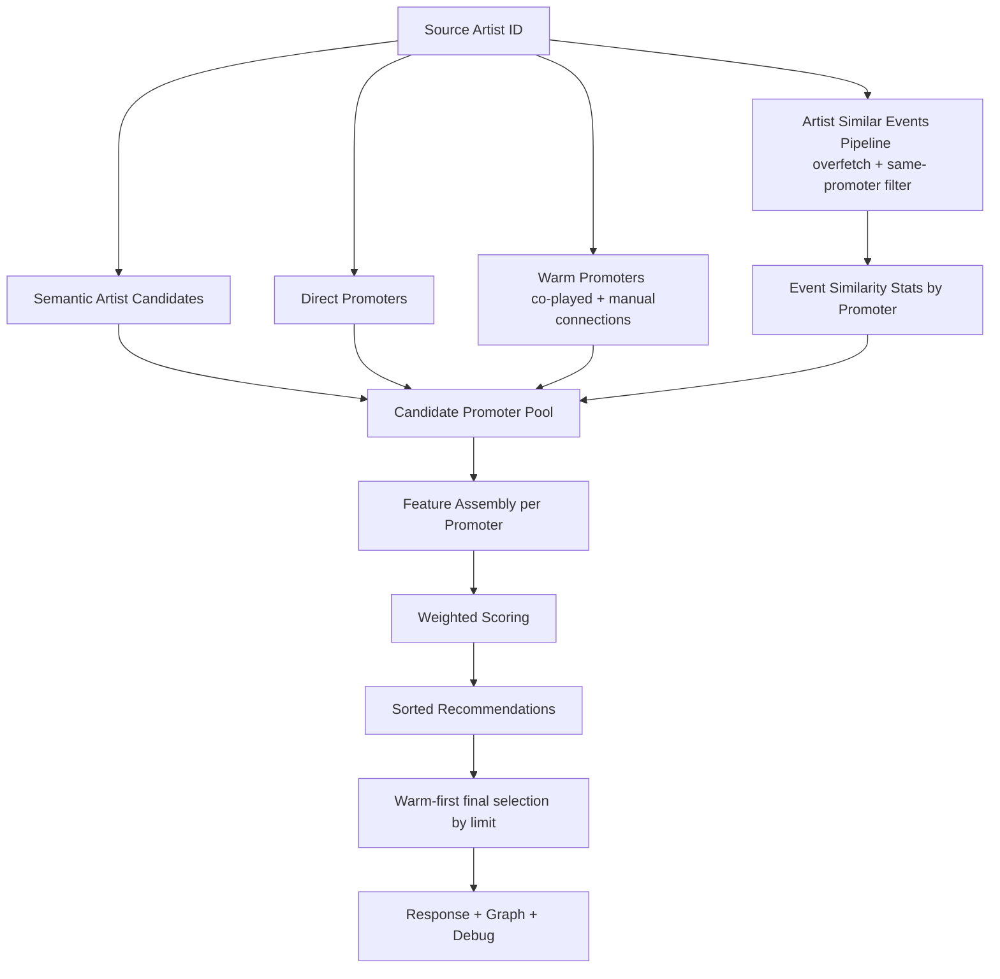
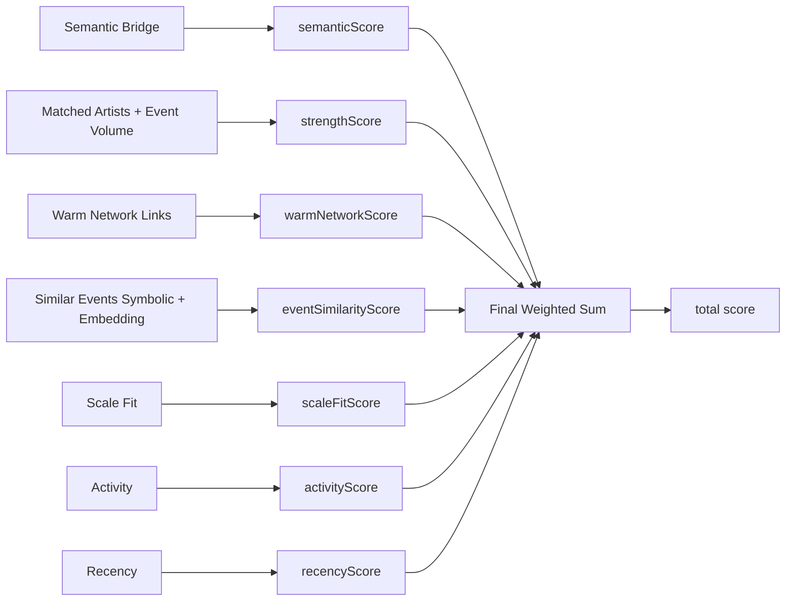
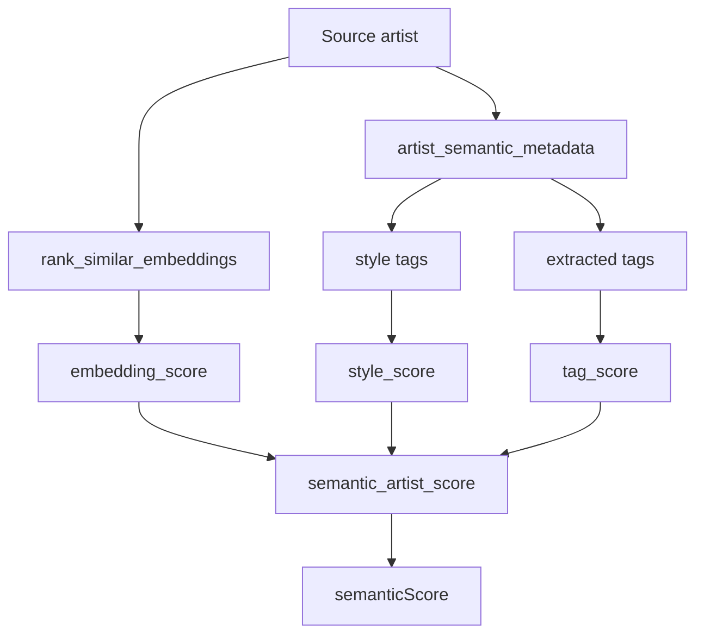
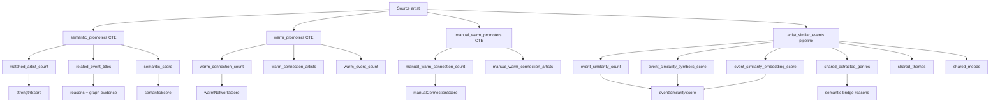
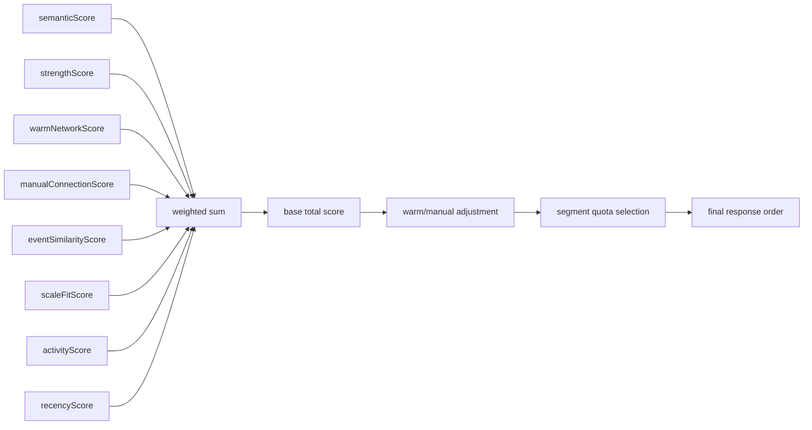

# Recommendation Engine

This document is the current source of truth for the MVP recommendation flow in this repository.

## AI Module Requirement Coverage

This document is the source of truth for the project AI / recommendation scoring module.

- Major: Recommendation system using machine learning.
  - Personalized recommendations based on user behavior.
  - Collaborative filtering or content-based filtering.
  - Continuously improve recommendations over time.

In Scenegraph, the AI path is represented by promoter recommendations for an artist. The engine combines content-based signals (artist/event embeddings and extracted tags), relationship-based ranking inputs (co-played artists, manual artist links, promoter event history), and feedback-aware scoring signals that improve recommendation quality over repeated user interaction.

This document intentionally stops at ranking, scoring, and debug-scoring explanation.
Graph visualization, graph payload structure, and evidence-path rendering are documented in `frontend/docs/custom_module_graph.md`.

## MVP Product Surface

Main user-facing flow:

```text
Artist -> Recommended Promoters
```

Primary endpoint:

```text
GET /api/recommendations/artists/{artist_id}/promoters
```

Important query params:

- `limit` (bounded by `PROMOTER_REC_API_LIMIT_MAX`, default 10)
- `debug` (default `false`)

## Current Response Contract (Promoter Recommendations)

Each recommendation includes:

- final `score`
- component `scoreBreakdown`
- human-readable score `reasons`
- relationship counters for warm/manual links
- optional debug payload (`rawSignals`, `normalizedScores`, `weightedScores`, top-level candidate counters)

## High-Level Data Flow



## Detailed Signal Flow



## Low-Level Signal Breakdown

The promoter recommendation score is assembled from smaller signals that come from different
parts of the backend. The table below shows where each signal originates and what it contains.

| Signal | What it means | Main code source | Built from |
| --- | --- | --- | --- |
| `semanticScore` | Artist-to-promoter semantic match | `backend/app/recommendations/services.py` + `helpers.py` | similar artists, style overlap, extracted-tag overlap |
| `strengthScore` | Strength of the promoter relationship | `backend/app/recommendations/services.py` | matched artist count + event volume |
| `warmNetworkScore` | Co-played artist links | `backend/app/recommendations/services.py` + `promoter_graph.py` | artists that shared source events with the source artist |
| `manualConnectionScore` | Trusted manual artist links | `backend/app/recommendations/services.py` + `promoter_graph.py` | manually connected artists that also appear on promoter events |
| `eventSimilarityScore` | Similar-event evidence for a promoter | `backend/app/recommendations/event_similarity.py` + `services.py` | similar events, semantic/embedding blend, same-promoter filtering |
| `scaleFitScore` | Artist/promoter size compatibility | `backend/app/recommendations/services.py` | source artist event count vs promoter event count |
| `activityScore` | How active the promoter is | `backend/app/recommendations/services.py` | promoter event count, capped |
| `recencyScore` | Recency of promoter activity | `backend/app/recommendations/promoter_graph.py` | most recent event date |

### How the lower-level nodes are counted

- `semanticScore`
  - `build_artist_semantic_candidates(...)` creates it from:
    - `embedding_score` from `rank_similar_embeddings(...)`
    - `style_score` from overlap between source artist style tags and candidate style tags
    - `tag_score` from overlap between source extracted tags and candidate extracted tags
  - the explicit semantic sub-scores are weighted and summed in
    `/Users/tghnx1/code/scenegraph/backend/app/recommendations/helpers.py`

- `strengthScore`
  - computed from two capped counts in
    `/Users/tghnx1/code/scenegraph/backend/app/recommendations/services.py`
  - `matched_artist_count / strength_matched_artist_cap`
  - `min(event_count, strength_event_cap) / strength_event_cap`
  - then both parts are weighted and summed

- `warmNetworkScore`
  - counts co-played artists in `warm_promoters`
  - source path is:
    - source artist events
    - artists that played on those events
    - promoters for the events those artists played on
  - the score uses `warm_connection_count / warm_connection_cap`

- `manualConnectionScore`
  - counts manually linked artists in `manual_warm_promoters`
  - source path is:
    - source artist
    - manually trusted connected artist
    - events that artist played on
    - promoters for those events
  - the score uses `manual_relevant_warm_connection_count / manual_warm_connection_cap`

- `eventSimilarityScore`
  - comes from `artist_similar_events_scored_rows(...)`
  - built from:
    - `symbolic_score`
    - `shared_extracted_genres`
    - `shared_themes`
    - `shared_moods`
    - `embedding_score`
  - then blended through:
    - `event_similarity_symbolic_weight`
    - `event_similarity_embedding_weight`
  - if `event_similarity_semantic_only` is enabled, the symbolic contribution is suppressed

- `scaleFitScore`
  - computed by comparing source artist scale and promoter scale in log-ratio space
  - source artist scale is the number of distinct source events
  - promoter scale is the promoter event count
  - final score uses:
    - `scale_fit_score(...)`
    - `scale_bucket_match_multiplier(...)`

- `activityScore`
  - raw promoter event count is capped by `activity_event_cap`
  - score = `min(raw_event_count, activity_event_cap) / activity_event_cap`
  - this means bigger promoters get a higher score up to the cap

- `recencyScore`
  - based on the newest event date for that promoter
  - `date_recency_score(...)` returns:
    - `1.0` for a very recent event
    - lower values as the event gets older
    - `0.0` when the date is missing
  - the current implementation decays linearly over roughly one year

### Semantic score composition



### Promoter signal composition



### Final score assembly



## Scoring Formula (Current)

For each promoter candidate:

```text
total_score =
  w_semantic       * semanticScore
+ w_strength       * strengthScore
+ w_co_played      * coPlayedConnectionScore
+ w_manual         * manualConnectionScore
+ w_event_similarity * eventSimilarityScore
+ w_scale_fit      * scaleFitScore
+ w_activity       * activityScore
+ w_recency        * recencyScore
```

Notes:

- All promoter recommendation tuning lives in `backend/app/recommendations/config.yaml`.
- Direct promoter relationships remain visible as evidence and status, and they are split into:
  - co-played warm network contribution
  - manual trusted connection contribution
- Caps and normalization controls live in `backend/app/recommendations/config.yaml`.

## Candidate Collection and Internal Limits

Current limits are configurable through `backend/app/recommendations/config.yaml` (no hardcoded literals):

- `PROMOTER_REC_SQL_CANDIDATE_LIMIT`
- `PROMOTER_REC_EVENT_SIMILARITY_OVERFETCH_MULTIPLIER`
- `PROMOTER_REC_EVENT_SIMILARITY_OVERFETCH_MIN`
- `PROMOTER_REC_API_LIMIT_MAX`

### What each does

- SQL candidate limit: max promoters pulled from semantic/direct/warm union before scoring.
- Similar-events overfetch: internal depth for event-similarity evidence before filtering.
- API max limit: upper bound for requested response size.

## Final Selection Logic (Important)

Current top-N behavior is **warm-first**:

1. Score and sort all candidates by `total_score` descending.
2. Split into two groups:
   - warm group: `warmConnectionCount > 0`
   - discovery group: `warmConnectionCount == 0`
3. Fill final `limit` with:
   - warm recommendations first (up to limit)
   - then discovery recommendations for remaining slots

This means final top-N is not a pure score-only slice when warm candidates exist.

## Reason Strings (Current)

Reasons are now enriched with names, not only counts.

Examples:

- `1 co-played artists connected: dOctOr doms`
- `4 similar artists connected: A, B, C, D`
- `2 similar promoter events: Event X, Event Y`
- `5 related promoter events: ...`

These phrases come from:

- `co-played artists connected` from warm network evidence
- `similar artists connected` from semantic artist matches
- `similar promoter events` from the event-similarity pipeline
- `related promoter events` from the promoter’s own related event titles

## Event Similarity in Promoter Pipeline

`Artist -> Promoters` uses the same internal similar-events pipeline for event-similarity signal.

- symbolic signals: venue / abstract genres / extracted genres / lineup
- embedding similarity: event text embedding
- same-promoter filter enabled for discovery mode
- overfetch before strict filters to preserve useful signal density

## Debug and Explainability

With `debug=true`:

- top-level:
  - `candidateCounts`
  - `filteredOut`
- per recommendation:
  - `rawSignals`
  - `normalizedScores`
  - `weightedScores`

Graph payload and evidence-neighborhood rendering are owned by `docs/custom_module.md`.

### Feedback Debug Test

Use this flow to verify that recommendation feedback is reflected in the debug scoring payload.

1. Get an API token:

```bash
TOKEN="$(curl -sk -X POST https://localhost:8443/api/login \
  -H "Content-Type: application/json" \
  -d '{"username":"maksim","password":"123"}' \
  | python3 -c 'import sys,json; print(json.load(sys.stdin)["access_token"])')"
```

2. Post a recommendation job in debug mode:

```bash
curl -sk -X POST "https://localhost:8443/api/recommendations/artists/2178/promoters/jobs" \
  -H "Content-Type: application/json" \
  -H "Authorization: Bearer $TOKEN" \
  -d '{"limit":10,"debug":true}'
```

Expected shape:

```json
{
  "jobId": "f0a7a302-aa95-40b9-a1ab-cc37a58145ee",
  "status": "queued"
}
```

3. Fetch the job result:

```bash
JOB_ID=f0a7a302-aa95-40b9-a1ab-cc37a58145ee

curl -sk "https://localhost:8443/api/recommendations/jobs/$JOB_ID" \
  -H "Authorization: Bearer $TOKEN" \
  | python3 -m json.tool
```

If the job is still `queued` or `running`, repeat the same request after a few seconds.

4. Check the feedback boost:

- Run the debug recommendation job before submitting feedback and save the payload.
- Submit positive or negative feedback for one recommendation.
- Run the same debug recommendation job again.
- Compare recommendation order, final score, `scoreBreakdown`, `rawSignals`, `normalizedScores`, and `weightedScores`.
- Positive feedback should increase the relevant feedback-aware contribution; negative feedback should decrease or suppress it.

Notes:

- Always use the real JWT from `/api/login`; placeholders such as `YOUR_TOKEN` or `123` return `Invalid token`.
- `debug: true` is required because normal recommendation responses may omit internal scoring details.
- Artist users can only request recommendations for the artist profile linked to their account. Agents and admins can access any artist profile.

## Known Product/Engineering Tradeoffs

- warm-first selection improves personal-network visibility but can suppress higher-score discovery candidates.
- SQL pre-limit improves latency but may drop some relevant promoters before full scoring.
- reason verbosity is intentionally high for analyst workflows; UI may later need compact mode.
- graph evidence and visual path rendering are intentionally separated into the custom module doc so the AI module stays focused on ranking.

## Operational Tuning Workflow

1. Run fixed artist benchmark set with `debug=true`.
2. Compare before/after for:
   - top-N composition
   - warm/discovery share
   - filtered-out counters
   - manual quality review
3. Adjust `backend/app/recommendations/config.yaml` only (no scoring hardcodes).
4. Re-run benchmark and commit tuned config separately.
