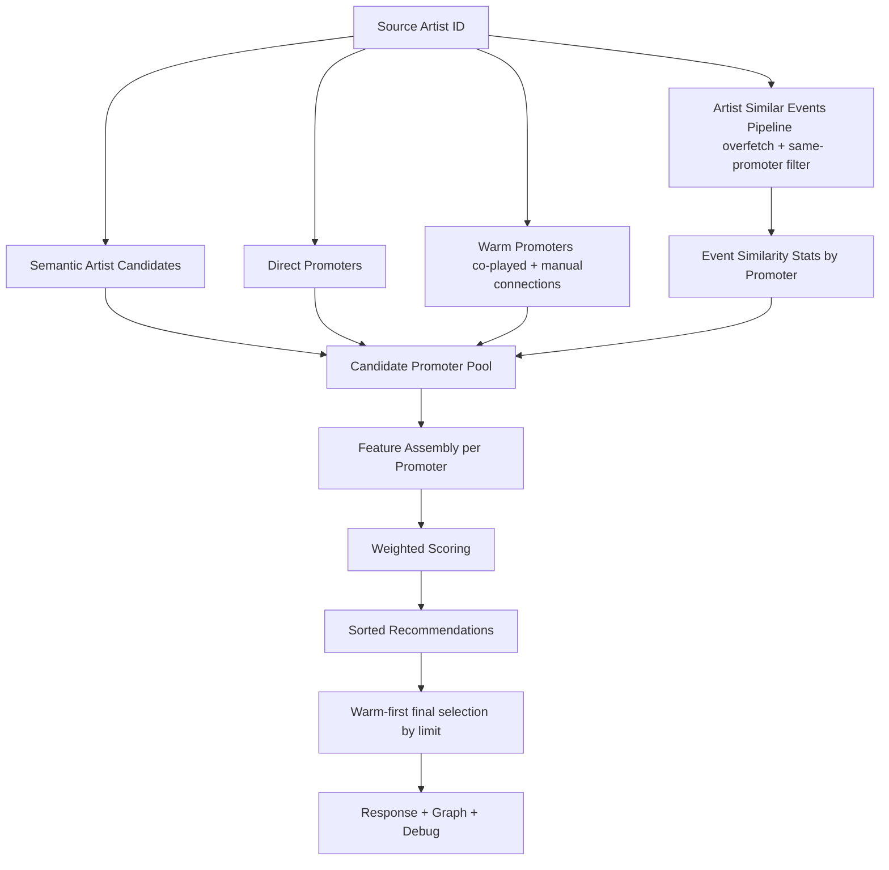
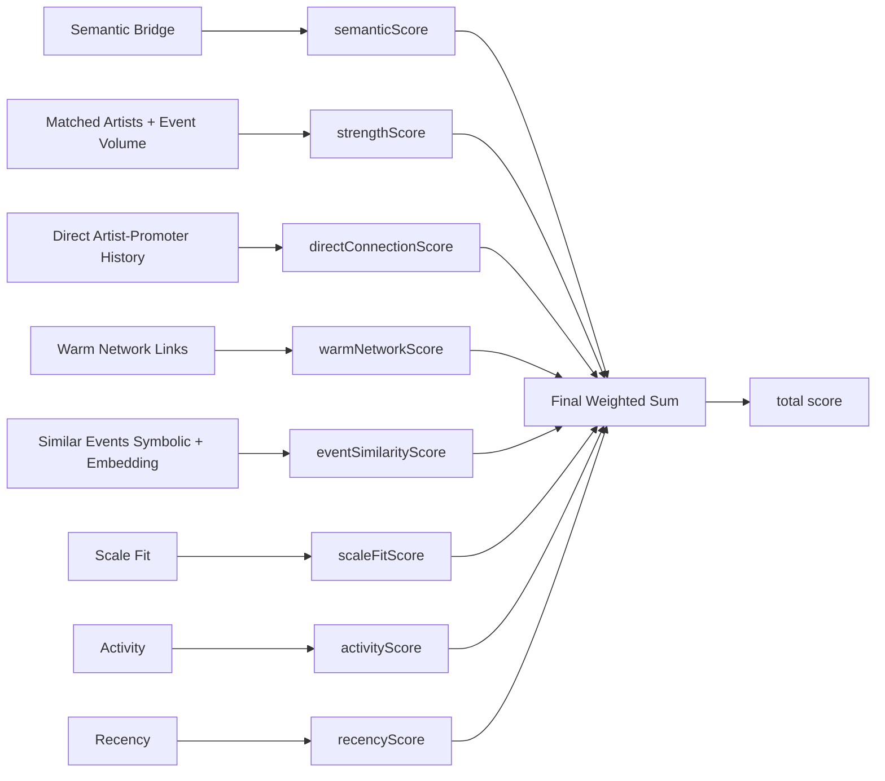

# Recommendation Engine

This document is the current source of truth for the MVP recommendation flow in this repository.

## MVP Product Surface

Main user-facing flow:

```text
Artist -> Recommended Promoters
```

Primary endpoint:

```text
GET /api/recommendations/artists/{artist_id}/promoters
```

Important query params:

- `limit` (bounded by `PROMOTER_REC_API_LIMIT_MAX`, default 10)
- `exclude_existing` (default `true`)
- `debug` (default `false`)

## Current Response Contract (Promoter Recommendations)

Each recommendation includes:

- final `score`
- component `scoreBreakdown`
- human-readable `reasons`
- relationship counters (`warmConnectionCount`, `directConnectionCount`, etc.)
- `warmConnectionArtists` (names + ids for warm links)
- `evidence` path types (`semantic_bridge`, `direct_connection`, `warm_network`, `event_similarity`)
- graph payload (`nodes`, `links`) for explanation UI
- optional debug payload (`rawSignals`, `normalizedScores`, `weightedScores`, top-level candidate counters)

## High-Level Data Flow



## Detailed Signal Flow



## Scoring Formula (Current)

For each promoter candidate:

```text
total_score =
  w_semantic       * semanticScore
+ w_strength       * strengthScore
+ w_direct         * directConnectionScore
+ w_warm           * warmNetworkScore
+ w_event_similarity * eventSimilarityScore
+ w_scale_fit      * scaleFitScore
+ w_activity       * activityScore
+ w_recency        * recencyScore
```

Notes:

- All `w_*` weights are read from `.env` (normalized in code).
- `exclude_existing=true` removes direct partners and zeros direct signal weight.
- Caps and normalization controls are env-driven (`*_CAP`, mix weights, edge-strength bounds).

## Candidate Collection and Internal Limits

Current limits are configurable through `.env` (no hardcoded literals):

- `PROMOTER_REC_SQL_CANDIDATE_LIMIT`
- `PROMOTER_REC_EVENT_SIMILARITY_OVERFETCH_MULTIPLIER`
- `PROMOTER_REC_EVENT_SIMILARITY_OVERFETCH_MIN`
- `PROMOTER_REC_API_LIMIT_MAX`

### What each does

- SQL candidate limit: max promoters pulled from semantic/direct/warm union before scoring.
- Similar-events overfetch: internal depth for event-similarity evidence before filtering.
- API max limit: upper bound for requested response size.

## Final Selection Logic (Important)

Current top-N behavior is **warm-first**:

1. Score and sort all candidates by `total_score` descending.
2. Split into two groups:
   - warm group: `warmConnectionCount > 0`
   - discovery group: `warmConnectionCount == 0`
3. Fill final `limit` with:
   - warm recommendations first (up to limit)
   - then discovery recommendations for remaining slots

This means final top-N is not a pure score-only slice when warm candidates exist.

## Reason Strings (Current)

Reasons are now enriched with names, not only counts.

Examples:

- `1 co-played artists connected: dOctOr doms`
- `4 similar artists connected: A, B, C, D`
- `2 similar promoter events: Event X, Event Y`
- `5 related promoter events: ...`

## Event Similarity in Promoter Pipeline

`Artist -> Promoters` uses the same internal similar-events pipeline for event-similarity signal.

- symbolic signals: venue / abstract genres / extracted genres / lineup
- embedding similarity: event text embedding
- same-promoter filter enabled for discovery mode
- overfetch before strict filters to preserve useful signal density

## Debug and Explainability

With `debug=true`:

- top-level:
  - `candidateCounts`
  - `filteredOut`
- per recommendation:
  - `rawSignals`
  - `normalizedScores`
  - `weightedScores`

Graph payload includes local evidence neighborhood only (not full database graph).

## Known Product/Engineering Tradeoffs

- warm-first selection improves personal-network visibility but can suppress higher-score discovery candidates.
- SQL pre-limit improves latency but may drop some relevant promoters before full scoring.
- reason verbosity is intentionally high for analyst workflows; UI may later need compact mode.

## Operational Tuning Workflow

1. Run fixed artist benchmark set with `debug=true`.
2. Compare before/after for:
   - top-N composition
   - warm/discovery share
   - filtered-out counters
   - manual quality review
3. Adjust `.env` only (no scoring hardcodes).
4. Re-run benchmark and commit tuned config separately.
