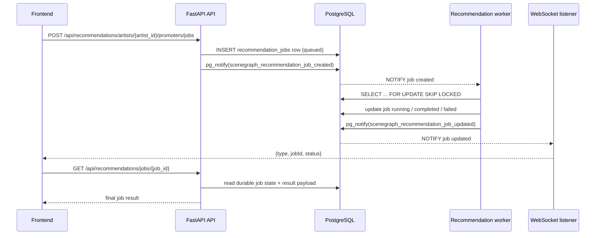
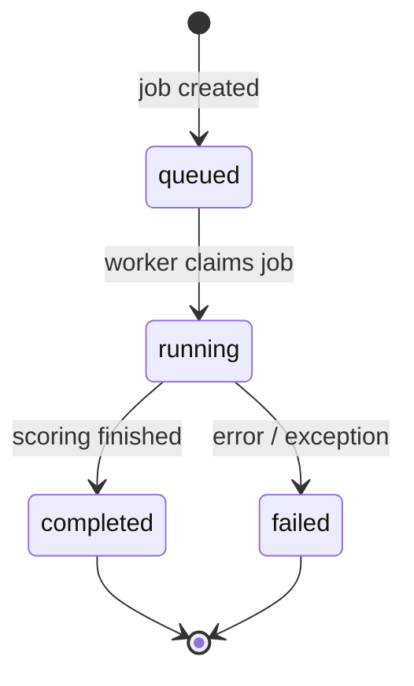

# Recommendation Jobs

Artist-to-promoter recommendations support a durable asynchronous flow in addition to the
existing synchronous endpoint.

## Request flow

1. The frontend creates a job with `POST /api/recommendations/artists/{artist_id}/promoters/jobs`.
2. The API stores a `queued` row in `recommendation_jobs` and calls
   `pg_notify('scenegraph_recommendation_job_created', ...)` in the same transaction.
3. A recommendation worker blocks on `LISTEN scenegraph_recommendation_job_created`, wakes,
   and claims work with `SELECT ... FOR UPDATE SKIP LOCKED`.
4. The worker stores `running`, `completed`, or `failed` state in PostgreSQL. Each state update
   calls `pg_notify('scenegraph_recommendation_job_updated', ...)` before commit.
5. Each backend process keeps one PostgreSQL listener for job updates and forwards only
   `{type, jobId, status}` to WebSocket clients owned by the affected user.
6. The frontend receives the signal and reads durable state through
   `GET /api/recommendations/jobs/{job_id}`. Full recommendation data never travels through
   WebSocket notifications.

### Current workflow diagram



### State lifecycle



PostgreSQL is the source of truth. Notifications are wake-up signals only. Workers drain queued
rows once at startup so jobs created while workers were offline are not lost. Frontend clients
also re-read their active job after WebSocket or PostgreSQL-listener reconnects.

## Processes

`make up` and `make upd` start one `recommendation-worker` replica by default. More workers can
safely share the same queue:

```bash
make upd RECOMMENDATION_WORKER=3
```

The worker service intentionally has no `container_name`, which allows Compose to create replicas.

## Deployment order

Apply Prisma migrations before deploying the backend and worker because schema preflight requires
the `recommendation_jobs` table:

```bash
make prisma-migrate
docker compose up -d --build
```

## Compatibility

The recommendation UI uses the job endpoints. The legacy artist-only recommendation endpoint
has been removed.
