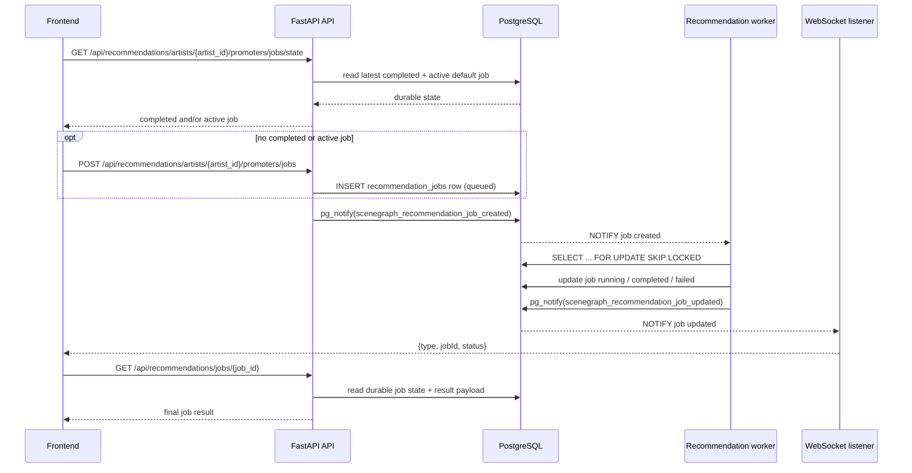
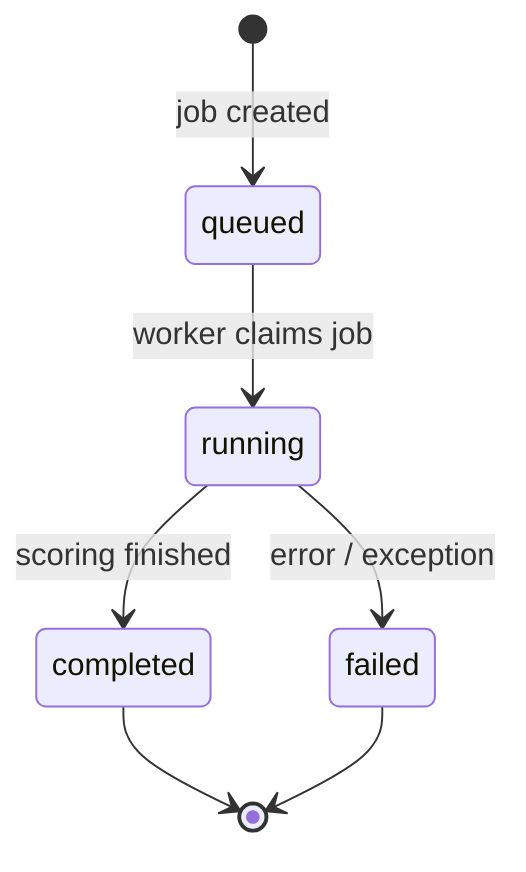

# Recommendation Jobs

Artist-to-promoter recommendations support a durable asynchronous flow in addition to the
existing synchronous endpoint.

## Request flow

1. The frontend bootstraps from
   `GET /api/recommendations/artists/{artist_id}/promoters/jobs/state`.
   PostgreSQL is authoritative; `sessionStorage` is never used to choose a job.
2. A completed job is displayed immediately. If an active job is also present, the completed
   result remains visible while the frontend attaches to that refresh.
3. An active-only response produces the initial loading state. Only when both state fields are
   empty does the frontend create a job with
   `POST /api/recommendations/artists/{artist_id}/promoters/jobs`.
4. The API first looks for an existing `queued` or `running` job with the same
   `(user_id, artist_id, job_type, params_hash)`.
5. If no active match exists, the API stores a new `queued` row in `recommendation_jobs` and
   calls `pg_notify('scenegraph_recommendation_job_created', ...)` in the same transaction.
6. A recommendation worker blocks on `LISTEN scenegraph_recommendation_job_created`, wakes,
   and claims work with `SELECT ... FOR UPDATE SKIP LOCKED`.
7. The worker stores `running`, `completed`, or `failed` state in PostgreSQL. Each state update
   calls `pg_notify('scenegraph_recommendation_job_updated', ...)` before commit.
8. Each backend process keeps one PostgreSQL listener for job updates and forwards only
   `{type, jobId, status}` to WebSocket clients owned by the affected user.
9. The frontend receives the signal and reads durable state through
   `GET /api/recommendations/jobs/{job_id}`. Full recommendation data never travels through
   WebSocket notifications.
10. Reloads and new tabs recover completed results from the state endpoint without creating a
    duplicate job.

### Current workflow diagram


```mermaid
sequenceDiagram
    participant FE as Frontend
    participant API as FastAPI API
    participant DB as PostgreSQL
    participant W as Recommendation worker
    participant WS as WebSocket listener

    FE->>API: GET /api/recommendations/artists/{artist_id}/promoters/jobs/state
    API->>DB: read latest completed + active default job
    DB-->>API: durable state
    API-->>FE: completed and/or active job
    opt no completed or active job
        FE->>API: POST /api/recommendations/artists/{artist_id}/promoters/jobs
        API->>DB: INSERT recommendation_jobs row (queued)
    end
    API->>DB: pg_notify(scenegraph_recommendation_job_created)
    DB-->>W: NOTIFY job created
    W->>DB: SELECT ... FOR UPDATE SKIP LOCKED
    W->>DB: update job running / completed / failed
    W->>DB: pg_notify(scenegraph_recommendation_job_updated)
    DB-->>WS: NOTIFY job updated
    WS-->>FE: {type, jobId, status}
    FE->>API: GET /api/recommendations/jobs/{job_id}
    API->>DB: read durable job state + result payload
    API-->>FE: final job result
```

### State lifecycle


```mermaid
stateDiagram-v2
    [*] --> queued: job created
    queued --> running: worker claims job
    running --> completed: scoring finished
    running --> failed: error / exception
    completed --> [*]
    failed --> [*]
```

PostgreSQL is the source of truth. Notifications are wake-up signals only. Workers drain queued
rows once at startup so jobs created while workers were offline are not lost. Frontend clients
also re-read their active job after WebSocket or PostgreSQL-listener reconnects.

Successful manual artist connection create/delete and promoter feedback create/update/delete
operations enqueue or reuse the default recommendation job for the authenticated user's own
artist. Admin or agent changes do not create a job owned by that admin or agent for another
artist. DB imports and event imports do not enqueue recommendation jobs. Biography changes
refresh recency only after the worker successfully updates derived tags and embeddings; there is
no revision or dependency invalidation system at this stage.

Active promoter recommendation jobs are concurrency-safe at the database layer through a partial
unique index on `(user_id, artist_id, job_type, params_hash)` for rows whose status is
`queued` or `running`. The API reuses an already-active row when it can, but the unique index is
the final authority for identical concurrent POSTs.

## Processes

`make up` and `make upd` start one `recommendation-worker` replica by default. More workers can
safely share the same queue:

```bash
make upd RECOMMENDATION_WORKER=3
```

The worker service intentionally has no `container_name`, which allows Compose to create replicas.

## One-shot scheduler

Run the bootstrap scheduler in a disposable backend container:

```bash
make recommendation-scheduler
```

This executes `python -m app.recommendations.scheduler` once and exits. It selects approved
artist accounts only, requires a usable current source artist embedding, and looks for artists
with a non-empty biography plus at least three distinct manual artist connections. Each eligible
pair uses the same `create_recommendation_job` path as the API, so an identical queued or
running job is reused. The scheduler makes no HTTP calls and is intended to run roughly daily,
not as an always-running Compose service.

## Deployment order

Apply Prisma migrations before deploying the backend and worker because schema preflight requires
the `recommendation_jobs` table:

```bash
make prisma-migrate
docker compose up -d --build
```

## Compatibility

The recommendation UI uses the job endpoints. The legacy artist-only recommendation endpoint
has been removed.

Explicit `Update recommendations` requests intentionally create a fresh job after completed or
failed runs, but they still reuse any identical active row that is already queued or running.
Scheduled bootstrap and manual recalculation are the supported ways to refresh recommendation
recency.
