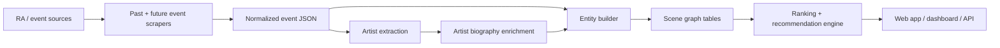
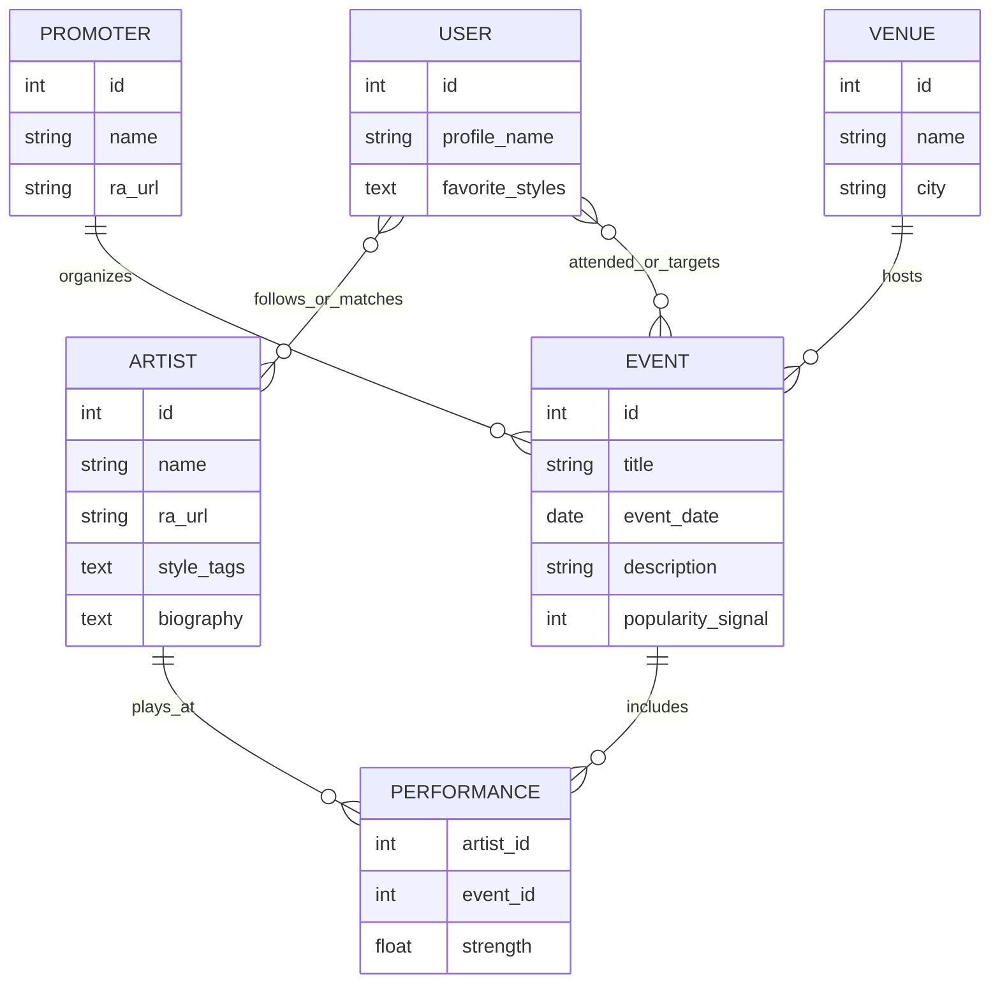
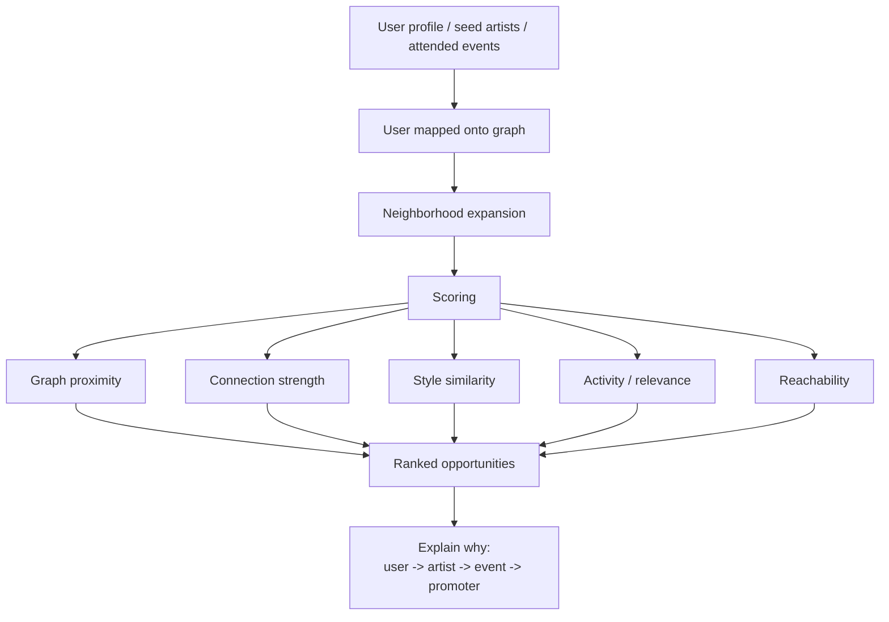

# Berlin Scene Graph

Small teammate-facing presentation for recruiting one more person into the project.

---

## Slide 1 - One-Line Idea

**Berlin Scene Graph** is a platform for emerging DJs that maps the Berlin nightlife ecosystem as a graph and turns raw event data into **realistic opportunities**:
- which promoters are close to your scene
- which venues fit your sound
- which artists and events are actually reachable from where you are now

The core idea is simple:

> not "who is most famous?", but "what is the next realistic move for this artist?"

---

## Slide 2 - The Problem

Today, an emerging DJ usually has:
- scattered information
- no clear map of the local scene
- no way to measure who is truly relevant to their current level

Most platforms optimize for visibility and hype.

We want to optimize for:
- **proximity**
- **fit**
- **reachability**

---

## Slide 3 - The Product

We collect nightlife event data, transform it into a graph, and build recommendations on top of it.

Main entities:
- artists
- events
- promoters
- venues

Main outputs:
- recommended promoters
- recommended venues
- closest artists in the scene
- reachable next events/opportunities
- explanation paths for each recommendation

---

## Slide 4 - Data Pipeline Schema

What already exists locally:
- event scraping pipeline
- artist extraction
- biography enrichment
- rolling backups and checkpoints for long crawls

---

## Slide 5 - Graph Schema

Interpretation:
- events are the backbone
- artists, promoters, and venues are derived from event context
- recommendations come from graph distance, repeated co-occurrence, and style similarity

---

## Slide 6 - Recommendation Logic Schema

Core product value:
- not black-box recommendations
- every suggestion should be explainable
- every suggestion should feel plausible for an emerging artist

---

## Slide 7 - Current Project Status

Current local pipeline state:
- about **39,160 events**
- about **21,810 artists**
- about **6,093 artist biographies**

Already defined in the project:
- frontend + backend web app direction
- database schema direction
- analytics/dashboard idea
- public API and recommendation engine scope

This means the project is no longer just an idea:
- the data foundation is already being built
- the graph model is clearly defined
- the next step is turning this into a product

---

## Slide 8 - Why This Is Interesting

This project sits at the intersection of:
- nightlife culture
- graph systems
- recommendation design
- product UX
- data engineering

Why it is fun to build:
- it has a clear real-world audience
- the data model is rich and non-trivial
- the output is visual and product-oriented
- we can show both engineering depth and a strong demo

---

## Slide 9 - Who We Need

Best fit for one more teammate:
- **full-stack developer** who enjoys product thinking
- or **backend/data-focused developer** interested in ranking, pipelines, and graph modeling

Very useful skills:
- TypeScript / React / Node
- PostgreSQL / Prisma
- data pipelines and scraping
- ranking / search / recommendation logic
- data visualization

Good first ownership areas for a new teammate:
- graph API endpoints
- recommendation scoring service
- dashboard visualization
- search and filtering
- data normalization / enrichment quality

---

## Slide 10 - Short Recruitment Pitch

We are building a **Berlin nightlife scene graph** for emerging DJs.

The goal is to turn event data into a living graph of artists, promoters, venues, and opportunities, then build a product that recommends **realistic next steps** instead of generic popularity rankings.

We already have the data pipeline moving, the graph model defined, and the product direction clear. What we need now is one more strong person to help turn the system into a polished full-stack product.

---

## 30-Second Version

We are building a graph-based platform for emerging DJs in Berlin.

It ingests event data, links artists, venues, promoters, and events into a scene graph, and then recommends realistic opportunities based on proximity, style fit, and reachability. The data pipeline already exists, and the next step is productizing it into a web app with recommendations, analytics, and search.

---

## One-Sentence Ask

We need one more teammate who wants to help build a real graph-driven music discovery product, not just a school project shell.
