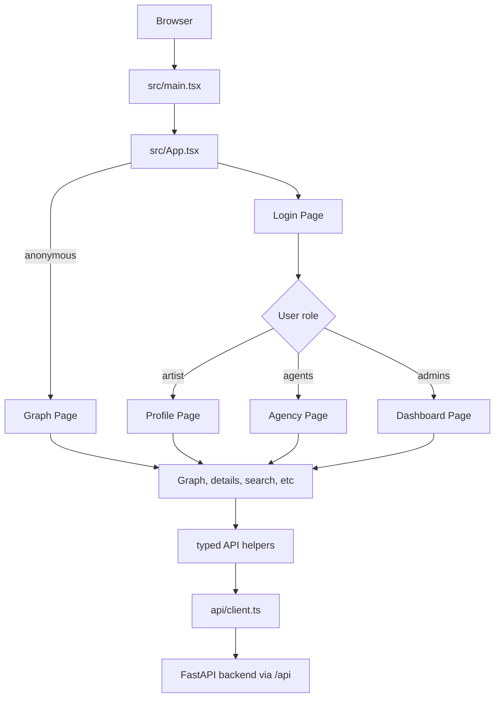

# Berlin Scenegraph Frontend

React and TypeScript client for exploring the Berlin Scenegraph API. The frontend renders the graph workspace, search and detail panels, artist/agent recommendation flows, admin dashboard, authentication screens, and static legal/contact pages.

The app is built with Vite, React Router, Tailwind CSS, a Zustand store, typed API helpers, and `react-force-graph-2d` for the graph canvas.

## Quick Start

From the repository root, the normal development path is to run the complete stack:

```bash
make upd
```

Then open:

```text
https://localhost:8443
```

For frontend-only development inside `frontend/`:

```bash
npm install
npm run dev
```

The Vite dev server runs on port `5173` inside the frontend container. In the Docker stack, NGINX exposes the app through `https://localhost:8443` (redirects `http://localhost:8080` to HTTPS), and forwards backend requests under `/api`.

## Frontend Simplified Flow



## Main Modules

```text
src/main.tsx                 React/Vite entry point
src/App.tsx                  Routes, layout, auth state, and navigation
src/api/                     Backend request helpers
src/pages/                   Page-level screens
src/pages/components/        Components used by pages
src/pages/hooks/             Page-specific React hooks
src/shared/                  Shared store, styles, UI, and utilities
src/types/                   TypeScript types for API data
```

## Runtime Behavior

`src/main.tsx` starts the React app, applies the saved theme, and enables React Router.

`src/App.tsx` owns the main layout, navigation, auth state, theme toggle, and route protection. It reads the saved `token` and `role` from `localStorage` and sends each user to the right workspace:

- anonymous users use the public graph page
- artists use the profile workspace
- agents use the agency workspace
- admins can use the agency workspace and dashboard

Search and selected graph entities are stored in the URL when possible. For example, `/graph?selectedType=artist&selectedId=2178` opens an artist ego graph.

`LoginPage` handles login and registration. After login, the token, role, username, and related IDs are stored in `localStorage`.

`ProfilePage` is the artist workspace. `AgencyPage` reuses much of the profile experience for agents. `DashboardPage` is admin-only and shows platform metrics, users, registrations, and activity logs.

## API Layer

All backend requests go through `src/api/client.ts`. It wraps `fetch`, adds the `/api` prefix, sends the auth token when one exists, parses JSON, handles errors, and redirects to `/login` on `401`.

Endpoint files such as `api/auth.ts`, `api/graph.ts`, `api/search.ts`, and `api/entityDetails.ts` keep the request paths and response types near the feature that uses them.

Plainly, `client.ts` is the shared request engine, and the other `api/*.ts` files are organized wrappers for specific backend features.

```
components/pages
    call feature API files like api/search.ts
        which call src/api/client.ts
            which calls the FastAPI backend
```

## Graph And Search Flow

The public graph page is built from three main parts:

- search input
- details panel
- force graph canvas

`useGraphSearchDetails()` coordinates search, selected entity details, and URL query parameters.

`ScenegraphMapPanel` renders the graph, loads either the full graph or an ego graph, manages filters, and shares selected node state through the Zustand graph store (A small state-management library to let separate components read and update shared graph state without passing that state through every parent component.).


## Styling

Global styles are in `src/shared/styles/base.css`. Theme helpers are in `src/shared/styles/colors.ts`, and the selected theme is stored in `localStorage` as `scenegraph-theme`.

Reusable UI primitives live in `src/shared/ui/`.
