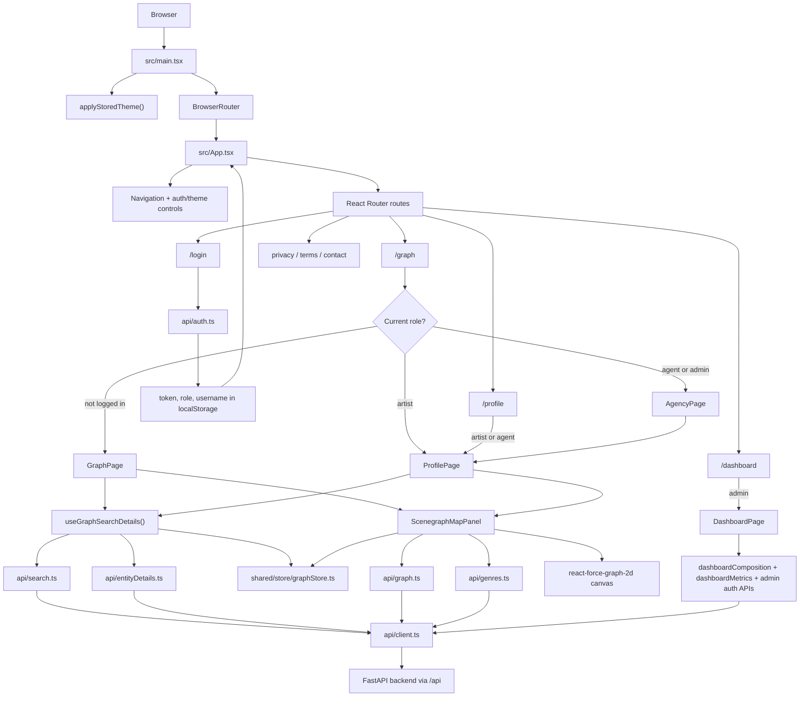

# Berlin Scene Graph Frontend

React and TypeScript client for exploring the Berlin Scene Graph API. The frontend renders the graph workspace, search and detail panels, artist/agent recommendation flows, admin dashboard, authentication screens, and static legal/contact pages.

The app is built with Vite, React Router, Tailwind CSS, a small Zustand store, typed API helpers, and `react-force-graph-2d` for the graph canvas.

## Quick Start

From the repository root, the normal development path is to run the complete stack:

```bash
make upd
```

Then open:

```text
https://localhost:8443
```

For frontend-only development inside `frontend/`:

```bash
npm install
npm run dev
```

The Vite dev server runs on port `5173` inside the frontend container. In the Docker stack, NGINX exposes the app through `https://localhost:8443`, redirects `http://localhost:8080` to HTTPS, and forwards backend requests under `/api`.

## Frontend Detail Flow



## Runtime Behavior

`src/main.tsx` is the browser entry point. It applies the stored light/dark theme, mounts React into `index.html`, and wraps the app in `BrowserRouter`.

`src/App.tsx` owns top-level layout, navigation, route protection, theme toggling, and the lightweight auth state. It reads `token` and `role` from `localStorage` on startup. The `/graph` route changes by role:

- anonymous users see the public `GraphPage`
- artists see `ProfilePage`
- agents and admins see `AgencyPage`
- admins can also open `DashboardPage`

Search and selected entity state is URL-driven where possible. For example, `/graph?selectedType=artist&selectedId=2178` opens an ego graph for that artist, while `/search?q=...` redirects to `/graph?q=...`.

## Main Modules

```text
src/main.tsx                 React/Vite entry point
src/App.tsx                  App shell, routes, auth state, nav, footer
src/api/                     Typed request helpers for backend endpoints
src/pages/                   Route-level pages
src/pages/components/        Feature components used by pages
src/pages/hooks/             Page-specific hooks for graph/search/dashboard behavior
src/shared/lib/              Small shared utilities
src/shared/store/            Zustand stores
src/shared/styles/           Global CSS and theme helpers
src/shared/ui/               Reusable UI primitives
src/types/                   TypeScript DTOs and domain types
```

## API Layer

All regular backend calls go through `src/api/client.ts`.

The shared `api` object wraps browser `fetch` and provides:

- `api.get<T>(path)`
- `api.post<T>(path, body)`
- `api.patch<T>(path, body)`
- `api.delete<T>(path)`

It prefixes requests with `/api`, attaches `Authorization: Bearer <token>` when a token exists, parses JSON responses, throws errors for non-2xx responses, and redirects to `/login` on `401`.

Endpoint-specific files keep request paths and response types close together:

- `api/auth.ts`: login, logout, registration, password changes, admin user actions, activity log export
- `api/graph.ts`: full graph and ego graph requests
- `api/search.ts`: global search with type/sort/limit parameters
- `api/entityDetails.ts`: artist, event, venue, and promoter details
- `api/dashboardComposition.ts`: dashboard composition counts
- `api/dashboardMetrics.ts`: dashboard metric panels
- `api/genres.ts`: genre filter options
- `api/recommendationFeedback.ts`: feedback on recommendations
- `api/manualArtistConnections.ts`: manually curated artist links

`api/useApi.ts` is a generic React hook for request state. Components pass it a fetcher and dependency list; it returns `data`, `isLoading`, `error`, and `refetch`.

## Graph And Search Flow

`GraphPage` is composed from three pieces:

- `SearchInputField` for search input and dropdown results
- `DetailsPanel` for selected/search result details
- `ScenegraphMapPanel` for the force graph canvas

`useGraphSearchDetails()` coordinates the sidebar. It reads URL search params, debounces dropdown search input, fetches submitted search results, fetches detail data for the selected entity, and exposes props for the search and details components.

`ScenegraphMapPanel` coordinates the canvas. It decides whether to fetch:

- `fetchGraph()` for the general graph
- `fetchEgoGraph()` when `selectedType` and `selectedId` are present in the URL
- provided graph data when another feature, such as recommendations, supplies a graph directly

It also owns graph filters, visible node-type filters, graph sizing, path highlighting, click handling, and `react-force-graph-2d` rendering. Graph node selection is shared through `shared/store/graphStore.ts`.

## Auth, Profile, Agency, And Admin Flow

`LoginPage` supports login and registration. Successful login stores the access token, role, username, and optional IDs in `localStorage`, then lets `App` route the user to the correct workspace.

`ProfilePage` is the artist workspace. It combines graph exploration, promoter recommendations, artist biography editing, and manual artist connections.

`AgencyPage` reuses `ProfilePage` with biography editing disabled and adds an artist search control so agents can request recommendations for a selected artist.

`DashboardPage` is admin-only. It fetches composition data, metric panels, users, pending registrations, and activity logs. It also listens for dashboard update events through `useDashboardUpdates()`.

## Imports And Libraries

The frontend uses two import styles:

- relative imports such as `../../api/graph.ts` for nearby feature files
- alias imports such as `@/shared/ui/button` for shared modules

The `@` alias points to `src/`. It is configured in both `vite.config.ts` and `tsconfig.app.json`.

Core library imports:

- `react` and `react-dom`: component rendering and hooks
- `react-router-dom`: browser routing, route redirects, URL params, and navigation
- `zustand`: global store for selected graph node state
- `react-force-graph-2d`: canvas force graph renderer
- `d3-force`: force simulation types/helpers used by graph physics code
- `lucide-react`: icons
- `tailwindcss` and `@tailwindcss/vite`: utility CSS build integration
- `clsx` and `tailwind-merge`: safe class name composition through `cn()`
- `class-variance-authority`: reusable UI variants, mainly in shared UI primitives
- `@radix-ui/react-slot`: `asChild` composition support for shared controls

## Styling

`src/shared/styles/base.css` contains global styles, Tailwind imports, layout defaults, component-specific utility classes, and CSS custom properties.

`src/shared/styles/colors.ts` manages theme persistence and exposes helpers for reading CSS variables. The active theme is stored as `scenegraph-theme` in `localStorage` and applied to `document.documentElement.dataset.theme`.

Reusable controls live in `src/shared/ui/`. They are intentionally small wrappers around regular HTML elements and Tailwind classes.

## Local Data Setup

When using a database dump for local development, the current manual workflow is:

```bash
make upd
docker compose exec -T db sh -lc 'PGPASSWORD="$POSTGRES_PASSWORD" psql -U "$POSTGRES_USER" -d postgres -c "CREATE ROLE postgres WITH SUPERUSER CREATEDB CREATEROLE LOGIN;"'
RESET_DB=1 make import-dump DUMP=./backend/data/scenegraph_dump.sql
make upd
```

Then open `https://localhost:8443`.

## Useful Frontend Commands

```bash
npm run dev      # start Vite dev server
npm run build    # type-check and build production assets
npm run preview  # serve the built assets locally
```
